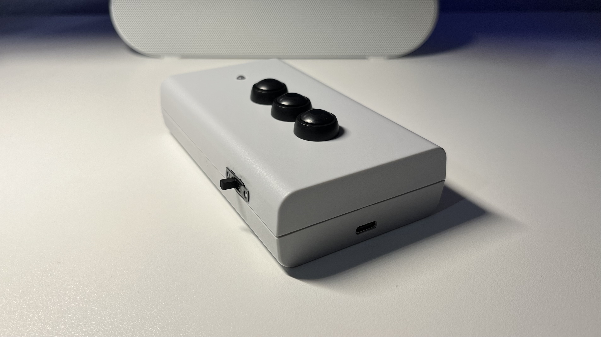
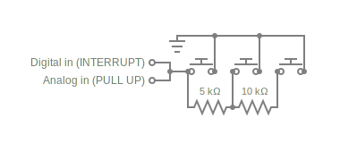

# ITS-150_Emulator
AVR 8-bit program for controlling _Intertechno_ radio built-in switches used e.g. in window shutters

## Capturing Signals
The [__ITS-150__](https://www.funkschalter-intertechno.de/ITS-150-Funk-Handsender) remote control, I emulated, works on the __433MHz__ Frequency (RC).
I sniffed the necessary commands with a logic analyzer and a RF receiver.\

As you can see, the __3 Byte__ command will be repeated __6 times__ in one transaction to determine the timing.\

The __commands.cpp__ file containing those commands will not be shared for safety reasons. But take a look at the regarding [headerfile](./main/command.h) if you're interested in the structure.

## Chip
Because of the rich amount of pins and the serial port, I decided to use the __ATmega328p__ with the [__8MHz__ bootloader](https://www.arduino.cc/en/uploads/Tutorial/breadboard-1-6-x.zip) as the heart, which can be easily programmed with the help of a [FTDI friend](https://www.berrybase.de/bread-board-mates-programmer).

## RF-Transmitter
The __XY-FST__ is a small, but powerful transmitter, which I amplified with an antenna.
The formula for calculating the length of the copper wire is __Lambda/4 = (speed of light/frequency)/4 = ~17cm__.
I connected an LED to the data line to indicate a transaction.

## Controls
For enabling later switching to an even smaller chip (with less GPIOs) like ATtiny85 (ISP Programmer or Arduino Development Board needed), I decided to use __analog buttons__ (voltage divider by resistor ladder) for interaction. Nether less I needed a __separat digital pin (Pull-Up) to interrupt the CPU__, which is less power consuming then polling and makes the sleep mode possible at all. You could also use the internal comparator, but it only works when the ADCs are disabled, so don't forget to turn them on again. This solution is scalable, if you wish to have more keys. For interrupting as rarely as possible, you could __debounce the digital pin on the hardware side__ instead of using a timer.\

## Case
[Polystyrol half-shell housing](https://www.berrybase.de/halbschalengehaeuse-120x30x70mm-grau)

## Programming
For simplicity, I used the __Arduino CLI__ (Toolchain for compiling and uploading with avrdude).
The [__RCSwitch__](https://github.com/sui77/rc-switch) library is pretty handy and offers the opportunity to pass in decimal numbers, which will be converted to a bitstream.

## Power supply
Because of the low power consumption I wanted to use 1x __2600 mAh Li-Ion battery (18650)__, which will be charged by a __TP4056-chip with USB-C port__. If you like to have multiple batteries to increase the voltage, be aware to use one charging module for each, so you can put them in series. Otherwise, they can (dis-)charge one another, which would lead to different loads and ultimately batterie-damage.
That’s why I used a __5V step up (boost) converter__, which efficiency is still good (~95%). But it’s worth mentioning, that its coil could possibly cause radio interference if not shielded well.
Also, do not forget to include a switch to cut off the load when charging the battery.

## Power consumption
### Measurements (standby)
Standard: 10mAh\
Optimized (Deep sleep, ADC off): __<0.1 mAh__